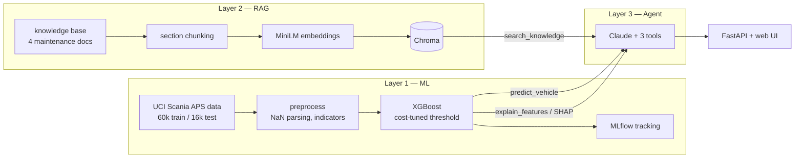

# Fleet Copilot

Predictive maintenance for heavy-truck fleets, in three connected layers:
an XGBoost failure classifier trained on real Scania truck telematics
data, a RAG knowledge layer over maintenance documentation, and a
tool-calling agent that explains *why* a vehicle was flagged by running
the actual model and citing the actual docs.

**Q:** *"Why is vehicle 42 flagged, and what should the workshop check first?"*

**A (agent):** probability 0.9695 vs. threshold 0.0025 → high-confidence
flag; top SHAP contributions from the `ag` histogram group; recommended
triage from the workshop playbook: pressure build-up test, leak-down test
(< 2 psi/min), air dryer check — each cited to its source chunk. The agent
declines to guess what anonymized sensors physically measure.

## Architecture



## Layer 1 — cost-sensitive failure classification

**Data.** [APS Failure at Scania Trucks](https://archive.ics.uci.edu/dataset/421/aps+failure+at+scania+trucks)
(UCI): 60,000 training rows from real trucks, 170 anonymized features,
1.67% positive class, 169/170 columns with missing values (worst: 82%).
The official metric is asymmetric: cost = 10·FP + 500·FN, because a
missed failure strands a truck while a false alarm costs one workshop
check. Accuracy is meaningless here — all-negative scores 98.3% accuracy
and costs 187,500.

**Results** (test set touched once per protocol):

| | v1 | v2 |
|---|---|---|
| Threshold selection | single 20% split (200 positives) | 5-fold OOF (1,000 positives) |
| Missing values | median imputation + indicators | native XGBoost NaN routing (won ablation) |
| Test cost | 14,800 | **11,010** |
| False negatives | 24 / 375 | **14 / 375** (96.3% recall) |
| PR-AUC | 0.906 | **0.929** |

Reference points: all-negative baseline 187,500; IDA 2016 challenge
winner 9,920.

**What changed between v1 and v2.** The v1 threshold was tuned on a
single validation split — a noisy estimate with only 200 positives.
Re-selecting it on out-of-fold probabilities used all 1,000 positives and
cut the test cost by 26%. An ablation also showed XGBoost's native
missing-value handling beats imputation on this data, which makes sense:
missingness here is systematic (sensor absent on a vehicle variant), not
random, and tree-based routing can exploit that directly. Isotonic
calibration was considered and dropped — monotone recalibration cannot
change decisions when the threshold is tuned on the same probabilities.

All experiments are tracked in MLflow (`mlflow ui --backend-store-uri file:mlruns`).

## Layer 2 — RAG with a measured retrieval layer

Knowledge base: four documents (APS system guide, dataset documentation,
model card, workshop triage playbook) → section-aware chunking → MiniLM
embeddings (local, no API needed) → Chroma.

Retrieval is evaluated, not assumed: 25 labeled questions, hit@4 and MRR,
comparing two chunking strategies.

| Strategy | hit@4 | MRR |
|---|---|---|
| fixed 800-char + overlap | 0.56 | 0.46 |
| **section-aware** | **1.00** | **0.81** |

The first version of this eval had a bug worth admitting: relevance
labels referenced section headings, which fixed-size chunks don't carry,
so the fixed strategy scored a near-impossible 0.04. The judge now falls
back to matching heading text inside the chunk body, making the
comparison fair — sections still win decisively on this KB.

## Layer 3 — an agent grounded in the real model

Three tools: `predict_vehicle` (runs the trained classifier),
`explain_features` (SHAP contributions via `pred_contribs`),
`search_knowledge` (Chroma retrieval). The system prompt enforces:
cite every knowledge claim as [chunk_id], never invent meanings for
anonymized features, present flags as prioritization signals rather than
diagnoses.

Observed behaviors during testing, both by design: when a knowledge
lookup failed transiently, the agent said so and declined to invent
triage steps rather than hallucinating them; and it reasoned about
opposite-signed SHAP values within one histogram group as a
distribution-shape signal without overclaiming the physical cause.

## Run it

See [RUNBOOK.md](RUNBOOK.md). Quick version:

```bash
pip install -r requirements.txt
python scripts/fetch_data.py          # UCI download
python scripts/run_eda.py             # EDA report
python scripts/train.py               # v1 baseline
python scripts/train_v2_stage.py ...  # v2 (see RUNBOOK)
python scripts/eval_rag.py            # retrieval evals (no API key)
python scripts/demo_agent.py          # full agent (needs ANTHROPIC_API_KEY in .env)
cd src && uvicorn fleet_copilot.api:app   # web UI at :8000
```

## Limitations

- Feature anonymity caps explanation quality; only histogram groups have
  documented physical meaning.
- The model classifies whether a *reported failure* is APS-related; it is
  not a remaining-useful-life forecaster.
- Trained on pre-2016 Scania data; transfer to other fleets is
  unquantified.
- The knowledge base is small and partly written for this project;
  retrieval numbers on a production corpus would be lower.

## Repository layout

```
src/fleet_copilot/   data, cost, rag, agent, api modules
scripts/             fetch_data, run_eda, train, train_v2_stage, eval_rag, demo_agent
knowledge_base/      4 markdown docs (the RAG corpus)
evals/               25 labeled retrieval questions
reports/             EDA summary, model comparison, RAG eval, final results
RUNBOOK.md           full reproduction commands
```
